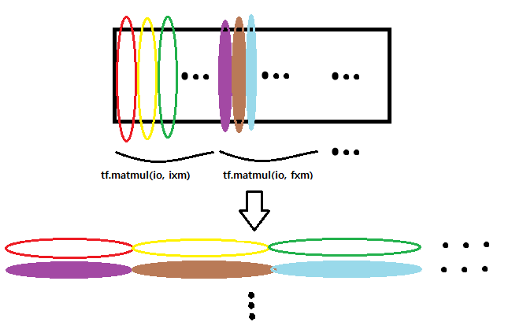

Deep Learning
=============

Assignment 6
------------

After training a skip-gram model in `5_word2vec.ipynb`, the goal of this notebook is to train a LSTM character model over [Text8](http://mattmahoney.net/dc/textdata) data.


```python
# These are all the modules we'll be using later. Make sure you can import them
# before proceeding further.
from __future__ import print_function
import os
import numpy as np
import random
import string
import tensorflow as tf
import zipfile
from six.moves import range
from six.moves.urllib.request import urlretrieve
```


    ---------------------------------------------------------------------------

    ImportError                               Traceback (most recent call last)

    <ipython-input-1-5bcab48aae42> in <module>()
          6 import random
          7 import string
    ----> 8 import tensorflow as tf
          9 import zipfile
         10 from six.moves import range


    ImportError: No module named tensorflow


```python
url = 'http://mattmahoney.net/dc/'

def maybe_download(filename, expected_bytes):
  """Download a file if not present, and make sure it's the right size."""
  if not os.path.exists(filename):
    filename, _ = urlretrieve(url + filename, filename)
  statinfo = os.stat(filename)
  if statinfo.st_size == expected_bytes:
    print('Found and verified %s' % filename)
  else:
    print(statinfo.st_size)
    raise Exception(
      'Failed to verify ' + filename + '. Can you get to it with a browser?')
  return filename

filename = maybe_download('text8.zip', 31344016)
```

    Found and verified text8.zip


```python
def read_data(filename):
  f = zipfile.ZipFile(filename)
  for name in f.namelist():
    return tf.compat.as_str(f.read(name))
  f.close()
  
text = read_data(filename)
print('Data size %d' % len(text))
```

    Data size 100000000


Create a small validation set.


```python
valid_size = 1000
valid_text = text[:valid_size]
train_text = text[valid_size:]
train_size = len(train_text)
print(train_size, train_text[:64])
print(valid_size, valid_text[:64])
```

    99999000 ons anarchists advocate social relations based upon voluntary as
    1000  anarchism originated as a term of abuse first used against earl


Utility functions to map characters to vocabulary IDs and back.


```python
vocabulary_size = len(string.ascii_lowercase) + 1 # [a-z] + ' '
first_letter = ord(string.ascii_lowercase[0])

def char2id(char):
  if char in string.ascii_lowercase:
    return ord(char) - first_letter + 1
  elif char == ' ':
    return 0
  else:
    print('Unexpected character: %s' % char)
    return 0
  
def id2char(dictid):
  if dictid > 0:
    return chr(dictid + first_letter - 1)
  else:
    return ' '

print(char2id('a'), char2id('z'), char2id(' '), char2id('ï'))
print(id2char(1), id2char(26), id2char(0))
```

    1 26 0 Unexpected character: ï
    0
    a z  


Function to generate a training batch for the LSTM model.


```python
batch_size=64
num_unrollings=10

class BatchGenerator(object):
  def __init__(self, text, batch_size, num_unrollings):
    self._text = text
    self._text_size = len(text)
    self._batch_size = batch_size
    self._num_unrollings = num_unrollings
    segment = self._text_size // batch_size
    self._cursor = [ offset * segment for offset in range(batch_size)]
    self._last_batch = self._next_batch()
  
  def _next_batch(self):
    """Generate a single batch from the current cursor position in the data."""
    batch = np.zeros(shape=(self._batch_size, vocabulary_size), dtype=np.float)
    for b in range(self._batch_size):
      batch[b, char2id(self._text[self._cursor[b]])] = 1.0
      self._cursor[b] = (self._cursor[b] + 1) % self._text_size
    return batch
  
  def next(self):
    """Generate the next array of batches from the data. The array consists of
    the last batch of the previous array, followed by num_unrollings new ones.
    """
    batches = [self._last_batch]
    for step in range(self._num_unrollings):
      batches.append(self._next_batch())
    self._last_batch = batches[-1]
    return batches

def characters(probabilities):
  """Turn a 1-hot encoding or a probability distribution over the possible
  characters back into its (most likely) character representation."""
  return [id2char(c) for c in np.argmax(probabilities, 1)]

def batches2string(batches):
  """Convert a sequence of batches back into their (most likely) string
  representation."""
  s = [''] * batches[0].shape[0]
  for b in batches:
    s = [''.join(x) for x in zip(s, characters(b))]
  return s

train_batches = BatchGenerator(train_text, batch_size, num_unrollings)
valid_batches = BatchGenerator(valid_text, 1, 1)

print(batches2string(train_batches.next()))
print(batches2string(train_batches.next()))
print(batches2string(valid_batches.next()))
print(batches2string(valid_batches.next()))
```

    ['ons anarchi', 'when milita', 'lleria arch', ' abbeys and', 'married urr', 'hel and ric', 'y and litur', 'ay opened f', 'tion from t', 'migration t', 'new york ot', 'he boeing s', 'e listed wi', 'eber has pr', 'o be made t', 'yer who rec', 'ore signifi', 'a fierce cr', ' two six ei', 'aristotle s', 'ity can be ', ' and intrac', 'tion of the', 'dy to pass ', 'f certain d', 'at it will ', 'e convince ', 'ent told hi', 'ampaign and', 'rver side s', 'ious texts ', 'o capitaliz', 'a duplicate', 'gh ann es d', 'ine january', 'ross zero t', 'cal theorie', 'ast instanc', ' dimensiona', 'most holy m', 't s support', 'u is still ', 'e oscillati', 'o eight sub', 'of italy la', 's the tower', 'klahoma pre', 'erprise lin', 'ws becomes ', 'et in a naz', 'the fabian ', 'etchy to re', ' sharman ne', 'ised empero', 'ting in pol', 'd neo latin', 'th risky ri', 'encyclopedi', 'fense the a', 'duating fro', 'treet grid ', 'ations more', 'appeal of d', 'si have mad']
    ['ists advoca', 'ary governm', 'hes nationa', 'd monasteri', 'raca prince', 'chard baer ', 'rgical lang', 'for passeng', 'the nationa', 'took place ', 'ther well k', 'seven six s', 'ith a gloss', 'robably bee', 'to recogniz', 'ceived the ', 'icant than ', 'ritic of th', 'ight in sig', 's uncaused ', ' lost as in', 'cellular ic', 'e size of t', ' him a stic', 'drugs confu', ' take to co', ' the priest', 'im to name ', 'd barred at', 'standard fo', ' such as es', 'ze on the g', 'e of the or', 'd hiver one', 'y eight mar', 'the lead ch', 'es classica', 'ce the non ', 'al analysis', 'mormons bel', 't or at lea', ' disagreed ', 'ing system ', 'btypes base', 'anguages th', 'r commissio', 'ess one nin', 'nux suse li', ' the first ', 'zi concentr', ' society ne', 'elatively s', 'etworks sha', 'or hirohito', 'litical ini', 'n most of t', 'iskerdoo ri', 'ic overview', 'air compone', 'om acnm acc', ' centerline', 'e than any ', 'devotional ', 'de such dev']
    [' a']
    ['an']


```python
def logprob(predictions, labels):
  """Log-probability of the true labels in a predicted batch."""
  predictions[predictions < 1e-10] = 1e-10
  return np.sum(np.multiply(labels, -np.log(predictions))) / labels.shape[0]

def sample_distribution(distribution):
  """Sample one element from a distribution assumed to be an array of normalized
  probabilities.
  """
  r = random.uniform(0, 1)
  s = 0
  for i in range(len(distribution)):
    s += distribution[i]
    if s >= r:
      return i
  return len(distribution) - 1

def sample(prediction):
  """Turn a (column) prediction into 1-hot encoded samples."""
  p = np.zeros(shape=[1, vocabulary_size], dtype=np.float)
  p[0, sample_distribution(prediction[0])] = 1.0
  return p

def random_distribution():
  """Generate a random column of probabilities."""
  b = np.random.uniform(0.0, 1.0, size=[1, vocabulary_size])
  return b/np.sum(b, 1)[:,None]
```

Simple LSTM Model.


```python
num_nodes = 64

graph = tf.Graph()
with graph.as_default():
  
  # Parameters:
  # Input gate: input, previous output, and bias.
  ix = tf.Variable(tf.truncated_normal([vocabulary_size, num_nodes], -0.1, 0.1))
  im = tf.Variable(tf.truncated_normal([num_nodes, num_nodes], -0.1, 0.1))
  ib = tf.Variable(tf.zeros([1, num_nodes]))
  # Forget gate: input, previous output, and bias.
  fx = tf.Variable(tf.truncated_normal([vocabulary_size, num_nodes], -0.1, 0.1))
  fm = tf.Variable(tf.truncated_normal([num_nodes, num_nodes], -0.1, 0.1))
  fb = tf.Variable(tf.zeros([1, num_nodes]))
  # Memory cell: input, state and bias.                             
  cx = tf.Variable(tf.truncated_normal([vocabulary_size, num_nodes], -0.1, 0.1))
  cm = tf.Variable(tf.truncated_normal([num_nodes, num_nodes], -0.1, 0.1))
  cb = tf.Variable(tf.zeros([1, num_nodes]))
  # Output gate: input, previous output, and bias.
  ox = tf.Variable(tf.truncated_normal([vocabulary_size, num_nodes], -0.1, 0.1))
  om = tf.Variable(tf.truncated_normal([num_nodes, num_nodes], -0.1, 0.1))
  ob = tf.Variable(tf.zeros([1, num_nodes]))
  # Variables saving state across unrollings.
  saved_output = tf.Variable(tf.zeros([batch_size, num_nodes]), trainable=False)
  saved_state = tf.Variable(tf.zeros([batch_size, num_nodes]), trainable=False)
  # Classifier weights and biases.
  w = tf.Variable(tf.truncated_normal([num_nodes, vocabulary_size], -0.1, 0.1))
  b = tf.Variable(tf.zeros([vocabulary_size]))
  
  # Definition of the cell computation.
  def lstm_cell(i, o, state):
    """Create a LSTM cell. See e.g.: http://arxiv.org/pdf/1402.1128v1.pdf
    Note that in this formulation, we omit the various connections between the
    previous state and the gates."""
    input_gate = tf.sigmoid(tf.matmul(i, ix) + tf.matmul(o, im) + ib)
    forget_gate = tf.sigmoid(tf.matmul(i, fx) + tf.matmul(o, fm) + fb)
    update = tf.matmul(i, cx) + tf.matmul(o, cm) + cb
    state = forget_gate * state + input_gate * tf.tanh(update)
    output_gate = tf.sigmoid(tf.matmul(i, ox) + tf.matmul(o, om) + ob)
    return output_gate * tf.tanh(state), state

  # Input data.
  train_data = list()
  for _ in range(num_unrollings + 1):
    train_data.append(
      tf.placeholder(tf.float32, shape=[batch_size,vocabulary_size]))
  train_inputs = train_data[:num_unrollings]
  train_labels = train_data[1:]  # labels are inputs shifted by one time step.

  # Unrolled LSTM loop.
  outputs = list()
  output = saved_output
  state = saved_state
  for i in train_inputs:
    output, state = lstm_cell(i, output, state)
    outputs.append(output)

  # State saving across unrollings.
  with tf.control_dependencies([saved_output.assign(output),
                                saved_state.assign(state)]):
    # Classifier.
    logits = tf.nn.xw_plus_b(tf.concat(0, outputs), w, b)
    loss = tf.reduce_mean(
      tf.nn.softmax_cross_entropy_with_logits(
        logits, tf.concat(0, train_labels)))

  # Optimizer.
  global_step = tf.Variable(0)
  learning_rate = tf.train.exponential_decay(
    10.0, global_step, 5000, 0.1, staircase=True)
  optimizer = tf.train.GradientDescentOptimizer(learning_rate)
  gradients, v = zip(*optimizer.compute_gradients(loss))
  gradients, _ = tf.clip_by_global_norm(gradients, 1.25)
  optimizer = optimizer.apply_gradients(
    zip(gradients, v), global_step=global_step)

  # Predictions.
  train_prediction = tf.nn.softmax(logits)
  
  # Sampling and validation eval: batch 1, no unrolling.
  sample_input = tf.placeholder(tf.float32, shape=[1, vocabulary_size])
  saved_sample_output = tf.Variable(tf.zeros([1, num_nodes]))
  saved_sample_state = tf.Variable(tf.zeros([1, num_nodes]))
  reset_sample_state = tf.group(
    saved_sample_output.assign(tf.zeros([1, num_nodes])),
    saved_sample_state.assign(tf.zeros([1, num_nodes])))
  sample_output, sample_state = lstm_cell(
    sample_input, saved_sample_output, saved_sample_state)
  with tf.control_dependencies([saved_sample_output.assign(sample_output),
                                saved_sample_state.assign(sample_state)]):
    sample_prediction = tf.nn.softmax(tf.nn.xw_plus_b(sample_output, w, b))
```


```python
num_steps = 7001
summary_frequency = 100

with tf.Session(graph=graph) as session:
  tf.initialize_all_variables().run()
  print('Initialized')
  mean_loss = 0
  for step in range(num_steps):
    batches = train_batches.next()
    feed_dict = dict()
    for i in range(num_unrollings + 1):
      feed_dict[train_data[i]] = batches[i]
    _, l, predictions, lr = session.run(
      [optimizer, loss, train_prediction, learning_rate], feed_dict=feed_dict)
    mean_loss += l
    if step % summary_frequency == 0:
      if step > 0:
        mean_loss = mean_loss / summary_frequency
      # The mean loss is an estimate of the loss over the last few batches.
      print(
        'Average loss at step %d: %f learning rate: %f' % (step, mean_loss, lr))
      mean_loss = 0
      labels = np.concatenate(list(batches)[1:])
      print('Minibatch perplexity: %.2f' % float(
        np.exp(logprob(predictions, labels))))
      if step % (summary_frequency * 10) == 0:
        # Generate some samples.
        print('=' * 80)
        for _ in range(5):
          feed = sample(random_distribution())
          sentence = characters(feed)[0]
          reset_sample_state.run()
          for _ in range(79):
            prediction = sample_prediction.eval({sample_input: feed})
            feed = sample(prediction)
            sentence += characters(feed)[0]
          print(sentence)
        print('=' * 80)
      # Measure validation set perplexity.
      reset_sample_state.run()
      valid_logprob = 0
      for _ in range(valid_size):
        b = valid_batches.next()
        predictions = sample_prediction.eval({sample_input: b[0]})
        valid_logprob = valid_logprob + logprob(predictions, b[1])
      print('Validation set perplexity: %.2f' % float(np.exp(
        valid_logprob / valid_size)))
```

    Initialized
    Average loss at step 0 : 3.29904174805 learning rate: 10.0
    Minibatch perplexity: 27.09
    ================================================================================
    srk dwmrnuldtbbgg tapootidtu xsciu sgokeguw hi ieicjq lq piaxhazvc s fht wjcvdlh
    lhrvallvbeqqquc dxd y siqvnle bzlyw nr rwhkalezo siie o deb e lpdg  storq u nx o
    meieu nantiouie gdys qiuotblci loc hbiznauiccb cqzed acw l tsm adqxplku gn oaxet
    unvaouc oxchywdsjntdh zpklaejvxitsokeerloemee htphisb th eaeqseibumh aeeyj j orw
    ogmnictpycb whtup   otnilnesxaedtekiosqet  liwqarysmt  arj flioiibtqekycbrrgoysj
    ================================================================================
    Validation set perplexity: 19.99
    Average loss at step 100 : 2.59553678274 learning rate: 10.0
    Minibatch perplexity: 9.57
    Validation set perplexity: 10.60
    Average loss at step 200 : 2.24747137785 learning rate: 10.0
    Minibatch perplexity: 7.68
    Validation set perplexity: 8.84
    Average loss at step 300 : 2.09438110709 learning rate: 10.0
    Minibatch perplexity: 7.41
    Validation set perplexity: 8.13
    Average loss at step 400 : 1.99440989017 learning rate: 10.0
    Minibatch perplexity: 6.46
    Validation set perplexity: 7.58
    Average loss at step 500 : 1.9320810616 learning rate: 10.0
    Minibatch perplexity: 6.30
    Validation set perplexity: 6.88
    Average loss at step 600 : 1.90935629249 learning rate: 10.0
    Minibatch perplexity: 7.21
    Validation set perplexity: 6.91
    Average loss at step 700 : 1.85583009005 learning rate: 10.0
    Minibatch perplexity: 6.13
    Validation set perplexity: 6.60
    Average loss at step 800 : 1.82152368546 learning rate: 10.0
    Minibatch perplexity: 6.01
    Validation set perplexity: 6.37
    Average loss at step 900 : 1.83169809818 learning rate: 10.0
    Minibatch perplexity: 7.20
    Validation set perplexity: 6.23
    Average loss at step 1000 : 1.82217029214 learning rate: 10.0
    Minibatch perplexity: 6.73
    ================================================================================
    le action b of the tert sy ofter selvorang previgned stischdy yocal chary the co
    le relganis networks partucy cetinning wilnchan sics rumeding a fulch laks oftes
    hian andoris ret the ecause bistory l pidect one eight five lack du that the ses
    aiv dromery buskocy becomer worils resism disele retery exterrationn of hide in 
    mer miter y sught esfectur of the upission vain is werms is vul ugher compted by
    ================================================================================
    Validation set perplexity: 6.07
    Average loss at step 1100 : 1.77301145077 learning rate: 10.0
    Minibatch perplexity: 6.03
    Validation set perplexity: 5.89
    Average loss at step 1200 : 1.75306463003 learning rate: 10.0
    Minibatch perplexity: 6.50
    Validation set perplexity: 5.61
    Average loss at step 1300 : 1.72937195778 learning rate: 10.0
    Minibatch perplexity: 5.00
    Validation set perplexity: 5.60
    Average loss at step 1400 : 1.74773373723 learning rate: 10.0
    Minibatch perplexity: 6.48
    Validation set perplexity: 5.66
    Average loss at step 1500 : 1.7368799901 learning rate: 10.0
    Minibatch perplexity: 5.22
    Validation set perplexity: 5.44
    Average loss at step 1600 : 1.74528762937 learning rate: 10.0
    Minibatch perplexity: 5.85
    Validation set perplexity: 5.33
    Average loss at step 1700 : 1.70881183743 learning rate: 10.0
    Minibatch perplexity: 5.33
    Validation set perplexity: 5.56
    Average loss at step 1800 : 1.67776108027 learning rate: 10.0
    Minibatch perplexity: 5.33
    Validation set perplexity: 5.29
    Average loss at step 1900 : 1.64935536742 learning rate: 10.0
    Minibatch perplexity: 5.29
    Validation set perplexity: 5.15
    Average loss at step 2000 : 1.69528644681 learning rate: 10.0
    Minibatch perplexity: 5.13
    ================================================================================
    vers soqually have one five landwing to docial page kagan lower with ther batern
    ctor son alfortmandd tethre k skin the known purated to prooust caraying the fit
    je in beverb is the sournction bainedy wesce tu sture artualle lines digra forme
    m rousively haldio ourso ond anvary was for the seven solies hild buil  s  to te
    zall for is it is one nine eight eight one neval to the kime typer oene where he
    ================================================================================
    Validation set perplexity: 5.25
    Average loss at step 2100 : 1.68808053017 learning rate: 10.0
    Minibatch perplexity: 5.17
    Validation set perplexity: 5.01
    Average loss at step 2200 : 1.68322490931 learning rate: 10.0
    Minibatch perplexity: 5.09
    Validation set perplexity: 5.15
    Average loss at step 2300 : 1.64465074301 learning rate: 10.0
    Minibatch perplexity: 5.51
    Validation set perplexity: 5.00
    Average loss at step 2400 : 1.66408578038 learning rate: 10.0
    Minibatch perplexity: 5.86
    Validation set perplexity: 4.80
    Average loss at step 2500 : 1.68515402555 learning rate: 10.0
    Minibatch perplexity: 5.75
    Validation set perplexity: 4.82
    Average loss at step 2600 : 1.65405208349 learning rate: 10.0
    Minibatch perplexity: 5.38
    Validation set perplexity: 4.85
    Average loss at step 2700 : 1.65706222177 learning rate: 10.0
    Minibatch perplexity: 5.46
    Validation set perplexity: 4.78
    Average loss at step 2800 : 1.65204829812 learning rate: 10.0
    Minibatch perplexity: 5.06
    Validation set perplexity: 4.64
    Average loss at step 2900 : 1.65107253551 learning rate: 10.0
    Minibatch perplexity: 5.00
    Validation set perplexity: 4.61
    Average loss at step 3000 : 1.6495274055 learning rate: 10.0
    Minibatch perplexity: 4.53
    ================================================================================
    ject covered in belo one six six to finsh that all di rozial sime it a the lapse
    ble which the pullic bocades record r to sile dric two one four nine seven six f
     originally ame the playa ishaps the stotchational in a p dstambly name which as
    ore volum to bay riwer foreal in nuily operety can and auscham frooripm however 
    kan traogey was lacous revision the mott coupofiteditey the trando insended frop
    ================================================================================
    Validation set perplexity: 4.76
    Average loss at step 3100 : 1.63705502152 learning rate: 10.0
    Minibatch perplexity: 5.50
    Validation set perplexity: 4.76
    Average loss at step 3200 : 1.64740695596 learning rate: 10.0
    Minibatch perplexity: 4.84
    Validation set perplexity: 4.67
    Average loss at step 3300 : 1.64711504817 learning rate: 10.0
    Minibatch perplexity: 5.39
    Validation set perplexity: 4.57
    Average loss at step 3400 : 1.67113256454 learning rate: 10.0
    Minibatch perplexity: 5.56
    Validation set perplexity: 4.71
    Average loss at step 3500 : 1.65637169957 learning rate: 10.0
    Minibatch perplexity: 5.03
    Validation set perplexity: 4.80
    Average loss at step 3600 : 1.66601825476 learning rate: 10.0
    Minibatch perplexity: 4.63
    Validation set perplexity: 4.52
    Average loss at step 3700 : 1.65021387935 learning rate: 10.0
    Minibatch perplexity: 5.50
    Validation set perplexity: 4.56
    Average loss at step 3800 : 1.64481814981 learning rate: 10.0
    Minibatch perplexity: 4.60
    Validation set perplexity: 4.54
    Average loss at step 3900 : 1.642069453 learning rate: 10.0
    Minibatch perplexity: 4.91
    Validation set perplexity: 4.54
    Average loss at step 4000 : 1.65179730773 learning rate: 10.0
    Minibatch perplexity: 4.77
    ================================================================================
    k s rasbonish roctes the nignese at heacle was sito of beho anarchys and with ro
    jusar two sue wletaus of chistical in causations d ow trancic bruthing ha laters
    de and speacy pulted yoftret worksy zeatlating to eight d had to ie bue seven si
    s fiction of the feelly constive suq flanch earlied curauking bjoventation agent
    quen s playing it calana our seopity also atbellisionaly comexing the revideve i
    ================================================================================
    Validation set perplexity: 4.58
    Average loss at step 4100 : 1.63794238806 learning rate: 10.0
    Minibatch perplexity: 5.47
    Validation set perplexity: 4.79
    Average loss at step 4200 : 1.63822438836 learning rate: 10.0
    Minibatch perplexity: 5.30
    Validation set perplexity: 4.54
    Average loss at step 4300 : 1.61844664574 learning rate: 10.0
    Minibatch perplexity: 4.69
    Validation set perplexity: 4.54
    Average loss at step 4400 : 1.61255454302 learning rate: 10.0
    Minibatch perplexity: 4.67
    Validation set perplexity: 4.54
    Average loss at step 4500 : 1.61543365479 learning rate: 10.0
    Minibatch perplexity: 4.83
    Validation set perplexity: 4.69
    Average loss at step 4600 : 1.61607327104 learning rate: 10.0
    Minibatch perplexity: 5.18
    Validation set perplexity: 4.64
    Average loss at step 4700 : 1.62757282495 learning rate: 10.0
    Minibatch perplexity: 4.24
    Validation set perplexity: 4.66
    Average loss at step 4800 : 1.63222063541 learning rate: 10.0
    Minibatch perplexity: 5.30
    Validation set perplexity: 4.53
    Average loss at step 4900 : 1.63678096652 learning rate: 10.0
    Minibatch perplexity: 5.43
    Validation set perplexity: 4.64
    Average loss at step 5000 : 1.610340662 learning rate: 1.0
    Minibatch perplexity: 5.10
    ================================================================================
    in b one onarbs revieds the kimiluge that fondhtic fnoto cre one nine zero zero 
     of is it of marking panzia t had wap ironicaghni relly deah the omber b h menba
    ong messified it his the likdings ara subpore the a fames distaled self this int
    y advante authors the end languarle meit common tacing bevolitione and eight one
    zes that materly difild inllaring the fusts not panition assertian causecist bas
    ================================================================================
    Validation set perplexity: 4.69
    Average loss at step 5100 : 1.60593637228 learning rate: 1.0
    Minibatch perplexity: 4.69
    Validation set perplexity: 4.47
    Average loss at step 5200 : 1.58993269444 learning rate: 1.0
    Minibatch perplexity: 4.65
    Validation set perplexity: 4.39
    Average loss at step 5300 : 1.57930587292 learning rate: 1.0
    Minibatch perplexity: 5.11
    Validation set perplexity: 4.39
    Average loss at step 5400 : 1.58022856832 learning rate: 1.0
    Minibatch perplexity: 5.19
    Validation set perplexity: 4.37
    Average loss at step 5500 : 1.56654450059 learning rate: 1.0
    Minibatch perplexity: 4.69
    Validation set perplexity: 4.33
    Average loss at step 5600 : 1.58013380885 learning rate: 1.0
    Minibatch perplexity: 5.13
    Validation set perplexity: 4.35
    Average loss at step 5700 : 1.56974959254 learning rate: 1.0
    Minibatch perplexity: 5.00
    Validation set perplexity: 4.34
    Average loss at step 5800 : 1.5839582932 learning rate: 1.0
    Minibatch perplexity: 4.88
    Validation set perplexity: 4.31
    Average loss at step 5900 : 1.57129439116 learning rate: 1.0
    Minibatch perplexity: 4.66
    Validation set perplexity: 4.32
    Average loss at step 6000 : 1.55144061089 learning rate: 1.0
    Minibatch perplexity: 4.55
    ================================================================================
    utic clositical poopy stribe addi nixe one nine one zero zero eight zero b ha ex
    zerns b one internequiption of the secordy way anti proble akoping have fictiona
    phare united from has poporarly cities book ins sweden emperor a sass in origina
    quulk destrebinist and zeilazar and on low and by in science over country weilti
    x are holivia work missincis ons in the gages to starsle histon one icelanctrotu
    ================================================================================
    Validation set perplexity: 4.30
    Average loss at step 6100 : 1.56450940847 learning rate: 1.0
    Minibatch perplexity: 4.77
    Validation set perplexity: 4.27
    Average loss at step 6200 : 1.53433164835 learning rate: 1.0
    Minibatch perplexity: 4.77
    Validation set perplexity: 4.27
    Average loss at step 6300 : 1.54773445129 learning rate: 1.0
    Minibatch perplexity: 4.76
    Validation set perplexity: 4.25
    Average loss at step 6400 : 1.54021131516 learning rate: 1.0
    Minibatch perplexity: 4.56
    Validation set perplexity: 4.24
    Average loss at step 6500 : 1.56153374553 learning rate: 1.0
    Minibatch perplexity: 5.43
    Validation set perplexity: 4.27
    Average loss at step 6600 : 1.59556478739 learning rate: 1.0
    Minibatch perplexity: 4.92
    Validation set perplexity: 4.28
    Average loss at step 6700 : 1.58076951623 learning rate: 1.0
    Minibatch perplexity: 4.77
    Validation set perplexity: 4.30
    Average loss at step 6800 : 1.6070714438 learning rate: 1.0
    Minibatch perplexity: 4.98
    Validation set perplexity: 4.28
    Average loss at step 6900 : 1.58413293839 learning rate: 1.0
    Minibatch perplexity: 4.61
    Validation set perplexity: 4.29
    Average loss at step 7000 : 1.57905534983 learning rate: 1.0
    Minibatch perplexity: 5.08
    ================================================================================
    jague are officiencinels ored by film voon higherise haik one nine on the iffirc
    oshe provision that manned treatists on smalle bodariturmeristing the girto in s
    kis would softwenn mustapultmine truativersakys bersyim by s of confound esc bub
    ry of the using one four six blain ira mannom marencies g with fextificallise re
     one son vit even an conderouss to person romer i a lebapter at obiding are iuse
    ================================================================================
    Validation set perplexity: 4.25


---
Problem 1
---------

You might have noticed that the definition of the LSTM cell involves 4 matrix multiplications with the input, and 4 matrix multiplications with the output. Simplify the expression by using a single matrix multiply for each, and variables that are 4 times larger.

---

Below is the matrix multiplications involved in LSTM cell.

    input_gate = tf.sigmoid(tf.matmul(i, ix) + tf.matmul(o, im) + ib)
    forget_gate = tf.sigmoid(tf.matmul(i, fx) + tf.matmul(o, fm) + fb)
    update = tf.matmul(i, cx) + tf.matmul(o, cm) + cb
    state = forget_gate * state + input_gate * tf.tanh(update)
    output_gate = tf.sigmoid(tf.matmul(i, ox) + tf.matmul(o, om) + ob)
    return output_gate * tf.tanh(state), state
    
We are going to reduce the number of matrix multiplications one by one.

First of all, for the **input_gate**,

    input_gate = tf.sigmoid(tf.matmul(i, ix) + tf.matmul(o, im) + ib)
               = tf.sigmoid(tf.matmul([i,o], [ix,im]) + ib)

[i,o] is a matrix where o is attached at the right of a matrix i, and [ix,im] is a matrix where im is attached at the bottom of a matrix ix.

So for [i,o], we want a matrix of size **batch x (vocabulary size + number of nodes)**,

and for [ix,im], we want **(vocabulary size + number of nodes) x number of nodes**.

This can reduce 2 matrix multiplications to 1. I will do the same thing for **forget_gate**, **update**, and **output_gate**.


```python
num_nodes = 64

graph = tf.Graph()
with graph.as_default():
  
  # Parameters:
  # Input gate: input, previous output, and bias.
  # ix and im are combined into ixm
  ixm = tf.Variable(tf.truncated_normal([vocabulary_size + num_nodes, num_nodes], -0.1, 0.1))
  ib = tf.Variable(tf.zeros([1, num_nodes]))
    
  # Forget gate: input, previous output, and bias.
  # fx and fm are combined into fxm
  fxm = tf.Variable(tf.truncated_normal([vocabulary_size + num_nodes, num_nodes], -0.1, 0.1))
  fb = tf.Variable(tf.zeros([1, num_nodes]))
    
  # Memory cell: input, state and bias.                             
  # cx and cm are combined into cxm
  cxm = tf.Variable(tf.truncated_normal([vocabulary_size + num_nodes, num_nodes], -0.1, 0.1))
  cb = tf.Variable(tf.zeros([1, num_nodes]))
    
  # Output gate: input, previous output, and bias.
  # ox and om are combined into oxm
  oxm = tf.Variable(tf.truncated_normal([vocabulary_size + num_nodes, num_nodes], -0.1, 0.1))
  ob = tf.Variable(tf.zeros([1, num_nodes]))
    
  # Variables saving state across unrollings.
  saved_output = tf.Variable(tf.zeros([batch_size, num_nodes]), trainable=False)
  saved_state = tf.Variable(tf.zeros([batch_size, num_nodes]), trainable=False)
  # Classifier weights and biases.
  w = tf.Variable(tf.truncated_normal([num_nodes, vocabulary_size], -0.1, 0.1))
  b = tf.Variable(tf.zeros([vocabulary_size]))
  
  # Definition of the cell computation.
  def lstm_cell(i, o, state):
    """Create a LSTM cell. See e.g.: http://arxiv.org/pdf/1402.1128v1.pdf
    Note that in this formulation, we omit the various connections between the
    previous state and the gates."""
    
    # i and o will be combined. o will be attached to the right of the i.
    # I will use tf.concat(concat_dim, values, name='concat') function.
    # concat function joins two matrices. 
    # If concat_dim=1 then matrices are joined horizontally, and
    # if concat_dim=0 then matrices are joined vertically.
    io = tf.concat(1, [i, o])
    
    input_gate = tf.sigmoid(tf.matmul(io, ixm) + ib)
    forget_gate = tf.sigmoid(tf.matmul(io, fxm) + fb)
    update = tf.matmul(io, cxm) + cb
    state = forget_gate * state + input_gate * tf.tanh(update)
    output_gate = tf.sigmoid(tf.matmul(io, oxm) + ob)
    return output_gate * tf.tanh(state), state

  # Input data.
  train_data = list()
  for _ in range(num_unrollings + 1):
    train_data.append(
      tf.placeholder(tf.float32, shape=[batch_size,vocabulary_size]))
  train_inputs = train_data[:num_unrollings]
  train_labels = train_data[1:]  # labels are inputs shifted by one time step.

  # Unrolled LSTM loop.
  outputs = list()
  output = saved_output
  state = saved_state
  for i in train_inputs:
    output, state = lstm_cell(i, output, state)
    outputs.append(output)

  # State saving across unrollings.
  with tf.control_dependencies([saved_output.assign(output),
                                saved_state.assign(state)]):
    # Classifier.
    logits = tf.nn.xw_plus_b(tf.concat(0, outputs), w, b)
    loss = tf.reduce_mean(
      tf.nn.softmax_cross_entropy_with_logits(
        logits, tf.concat(0, train_labels)))

  # Optimizer.
  global_step = tf.Variable(0)
  learning_rate = tf.train.exponential_decay(
    10.0, global_step, 5000, 0.1, staircase=True)
  optimizer = tf.train.GradientDescentOptimizer(learning_rate)
  gradients, v = zip(*optimizer.compute_gradients(loss))
  gradients, _ = tf.clip_by_global_norm(gradients, 1.25)
  optimizer = optimizer.apply_gradients(
    zip(gradients, v), global_step=global_step)

  # Predictions.
  train_prediction = tf.nn.softmax(logits)
  
  # Sampling and validation eval: batch 1, no unrolling.
  sample_input = tf.placeholder(tf.float32, shape=[1, vocabulary_size])
  saved_sample_output = tf.Variable(tf.zeros([1, num_nodes]))
  saved_sample_state = tf.Variable(tf.zeros([1, num_nodes]))
  reset_sample_state = tf.group(
    saved_sample_output.assign(tf.zeros([1, num_nodes])),
    saved_sample_state.assign(tf.zeros([1, num_nodes])))
  sample_output, sample_state = lstm_cell(
    sample_input, saved_sample_output, saved_sample_state)
  with tf.control_dependencies([saved_sample_output.assign(sample_output),
                                saved_sample_state.assign(sample_state)]):
    sample_prediction = tf.nn.softmax(tf.nn.xw_plus_b(sample_output, w, b))
```


    ---------------------------------------------------------------------------

    NameError                                 Traceback (most recent call last)

    <ipython-input-2-d3feac0d2b85> in <module>()
          1 num_nodes = 64
          2 
    ----> 3 graph = tf.Graph()
          4 with graph.as_default():
          5 


    NameError: name 'tf' is not defined


Now 4 matrix multiplications of input and output are reduced by 2 each.

    input_gate = tf.sigmoid(tf.matmul(io, ixm) + ib)
    forget_gate = tf.sigmoid(tf.matmul(io, fxm) + fb)
    update = tf.matmul(io, cxm) + cb
    state = forget_gate * state + input_gate * tf.tanh(update)
    output_gate = tf.sigmoid(tf.matmul(io, oxm) + ob)
    return output_gate * tf.tanh(state), state

Note that the matrix at the left is always **io** matrix, and **ixm** and **fxm** are pretty much the same.

We might be able to condense **input_gate** and **forget_gate** using only **1** matrix multiplication.

We will combine **ixm**, **fxm**, **cxm**, and **oxm** horizontally. 

Then the result matrix would have a size of **(vocabulary size + num_nodes) x (4 * number of nodes)**.

Call this matrix **ifco**, then **io** x **ifco** would have a size of **batch size x (4 * number of nodes)**.

Call this matrix **IO**. Then the matrix contains **input_gate**, **forget_gate**, **update**, and **output_gate**.

- **IO[:,:num_nodes]**: tf.matmul(io, ixm)
- **IO[:,num_nodes:2 x num_nodes]**: tf.matmul(io,fxm)
- **IO[:,2 x num_nodes:3 x num_nodes]**: tf.matmul(io,cxm)
- **IO[:,3 x num_nodes:]**: tf.matmul(io,oxm)

This method only involves **1** matrix multiplication.

Unfortunately, **IO** is a variable from tensorflow so it won't be indexed very conveniently.

We need to use **tf.gather** function but this function works best for **1D** matrix.

We are going to reshape **IO** matrix to **(4 x ((batch size) x (number of nodes)))**.


```python
from IPython.display import Image
Image("reshape.png")
```





The above diagram depicts how the **IO** matrix will be reshaped. This is drawn by *paint* so the quality of this diagram is terrible but hopefully this helps you what I am trying to do here.


```python
num_nodes = 64

graph = tf.Graph()
with graph.as_default():
  
  # Parameters:
  # [Input gate, Forget gate, Memory cell, Output gate]
  ifco = tf.Variable(tf.truncated_normal([vocabulary_size + num_nodes, 4 * num_nodes], -0.1, 0.1))
    
  # Input gate: bias.
  ib = tf.Variable(tf.zeros([1, num_nodes]))
    
  # Forget gate: bias.
  fb = tf.Variable(tf.zeros([1, num_nodes]))
    
  # Memory cell: bias.                             
  cb = tf.Variable(tf.zeros([1, num_nodes]))
    
  # Output gate: bias.
  ob = tf.Variable(tf.zeros([1, num_nodes]))
    
  # Variables saving state across unrollings.
  saved_output = tf.Variable(tf.zeros([batch_size, num_nodes]), trainable=False)
  saved_state = tf.Variable(tf.zeros([batch_size, num_nodes]), trainable=False)
  # Classifier weights and biases.
  w = tf.Variable(tf.truncated_normal([num_nodes, vocabulary_size], -0.1, 0.1))
  b = tf.Variable(tf.zeros([vocabulary_size]))
  
  # Definition of the cell computation.
  def lstm_cell(i, o, state):
    """Create a LSTM cell. See e.g.: http://arxiv.org/pdf/1402.1128v1.pdf
    Note that in this formulation, we omit the various connections between the
    previous state and the gates."""
    
    # i and o will be combined. o will be attached to the right of the i.
    # I will use tf.concat(concat_dim, values, name='concat') function.
    # concat function joins two matrices. 
    # If concat_dim=1 then matrices are joined horizontally, and
    # if concat_dim=0 then matrices are joined vertically.
    io = tf.concat(1, [i, o])
    
    # the matrix io (batch x (vocab_num + num_nodes)) and ifco ((vocab_num + num_nodes) x (4*num_nodes))
    # can be multiplied.
    IO = tf.matmul(io, ifco)
    
    # Reshaping IO matrix
    # first transpose IO matrix ((4*number of nodes) x batche size)
    IO_ = tf.transpose(IO)
    # Reshape it into (4 x ((batch size) x (number of nodes))) matrix
    IO_ = tf.reshape(IO,[4,-1])
    
    # index them and save them into 4 separte matrices
    input_gate = tf.sigmoid(tf.transpose(tf.reshape(tf.gather(IO_,[[0]]),[num_nodes, batch_size])) + ib)
    forget_gate = tf.sigmoid(tf.transpose(tf.reshape(tf.gather(IO_,[[1]]),[num_nodes, batch_size])) + fb)
    update = tf.transpose(tf.reshape(tf.gather(IO_,[[2]]),[num_nodes, batch_size])) + cb
    state = forget_gate * state + input_gate * tf.tanh(update)
    output_gate = tf.sigmoid(tf.transpose(tf.reshape(tf.gather(IO_,[[3]]),[num_nodes, batch_size])) + ob)
    return output_gate * tf.tanh(state), state

  # Input data.
  train_data = list()
  for _ in range(num_unrollings + 1):
    train_data.append(
      tf.placeholder(tf.float32, shape=[batch_size,vocabulary_size]))
  train_inputs = train_data[:num_unrollings]
  train_labels = train_data[1:]  # labels are inputs shifted by one time step.

  # Unrolled LSTM loop.
  outputs = list()
  output = saved_output
  state = saved_state
  for i in train_inputs:
    output, state = lstm_cell(i, output, state)
    outputs.append(output)

  # State saving across unrollings.
  with tf.control_dependencies([saved_output.assign(output),
                                saved_state.assign(state)]):
    # Classifier.
    logits = tf.nn.xw_plus_b(tf.concat(0, outputs), w, b)
    loss = tf.reduce_mean(
      tf.nn.softmax_cross_entropy_with_logits(
        logits, tf.concat(0, train_labels)))

  # Optimizer.
  global_step = tf.Variable(0)
  learning_rate = tf.train.exponential_decay(
    10.0, global_step, 5000, 0.1, staircase=True)
  optimizer = tf.train.GradientDescentOptimizer(learning_rate)
  gradients, v = zip(*optimizer.compute_gradients(loss))
  gradients, _ = tf.clip_by_global_norm(gradients, 1.25)
  optimizer = optimizer.apply_gradients(
    zip(gradients, v), global_step=global_step)

  # Predictions.
  train_prediction = tf.nn.softmax(logits)
  
  # Sampling and validation eval: batch 1, no unrolling.
  sample_input = tf.placeholder(tf.float32, shape=[1, vocabulary_size])
  saved_sample_output = tf.Variable(tf.zeros([1, num_nodes]))
  saved_sample_state = tf.Variable(tf.zeros([1, num_nodes]))
  reset_sample_state = tf.group(
    saved_sample_output.assign(tf.zeros([1, num_nodes])),
    saved_sample_state.assign(tf.zeros([1, num_nodes])))
  sample_output, sample_state = lstm_cell(
    sample_input, saved_sample_output, saved_sample_state)
  with tf.control_dependencies([saved_sample_output.assign(sample_output),
                                saved_sample_state.assign(sample_state)]):
    sample_prediction = tf.nn.softmax(tf.nn.xw_plus_b(sample_output, w, b))
```

---
Problem 2
---------

We want to train a LSTM over bigrams, that is pairs of consecutive characters like 'ab' instead of single characters like 'a'. Since the number of possible bigrams is large, feeding them directly to the LSTM using 1-hot encodings will lead to a very sparse representation that is very wasteful computationally.

a- Introduce an embedding lookup on the inputs, and feed the embeddings to the LSTM cell instead of the inputs themselves.

b- Write a bigram-based LSTM, modeled on the character LSTM above.

c- Introduce Dropout. For best practices on how to use Dropout in LSTMs, refer to this [article](http://arxiv.org/abs/1409.2329).

---

---
Problem 3
---------

(difficult!)

Write a sequence-to-sequence LSTM which mirrors all the words in a sentence. For example, if your input is:

    the quick brown fox
    
the model should attempt to output:

    eht kciuq nworb xof
    
Refer to the lecture on how to put together a sequence-to-sequence model, as well as [this article](http://arxiv.org/abs/1409.3215) for best practices.

---
